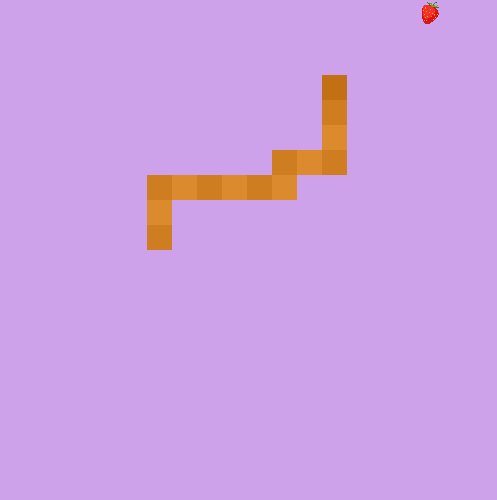

# Gra „Snake”
Celem pracy jest implementacja kultowej gry „Snake” w wersji zaprezentowanej w Nokii. Mimo swojego wieku gra dalej cieszy się popularnością. Projekt ma zachowywać podstawową funkcjonalność przy wykorzystaniu biblioteki ALLEGRO.
Gra ma na celu zapewnienie użytkownikowi rozrywki czytelnej w swej prostocie jednocześnie będąc przyjemną dla oka.  
Wybrałam powyższy temat projektu przez wzgląd na moich bliskich, będącymi fanami tej gry, dzięki czemu jest on rzeczywiście przezeń wykorzystywany.
## Cele projektu
Lp. | Cele | Priorytet
--- | ---- | -------
1 | Poruszanie się po planszy | Wysoki
2 | Zbieranie jedzenia | Wysoki
3 | Monitorowanie wyniku | Średni
4 | Zakończenie gry po zderzeniu | Wysoki
5 | Zapisywanie najlepszego wyniku | Niski
6 | Wybieranie schematu kolorów | Niski
7 | Efekt dźwiękowy przy zbieraniu owoców | Niski

## Opis
Przed rozpoczęciem rozgrywki przy użyciu terminala należy wybrać schemat kolorystyczny panujący w grze. Odbywa się to w następując sposób:  
  
Wówczas uruchamia się gra w adekwatnym do wyboru trybie  

  
Sterowanie odbywa się przy pomocy klawiszy *WSAD*, dodatkowo możliwe jest zakończenie gry klawiszem *Escape*.  
W grze zostaje zapisywany najlepszy dotchczasowy wynik w pliku ".txt" co umożliwia wygodne porównywanie swoich wyników, a dodatkowo dzięki takiej formie możliwe jest łatwe zresetowanie najlepszego wyniku poprzez wpisanie do pliku wartości "0".  Najlepszy wynik daje o sobie znak w terminalu po zakończeniu gry. W przypadku pobicia rekordu wypisuje **"New best score: WYNIK"**, a w wypadku przegranej **"Game Over with score WYNIK"**. Dodatkowo w trakcie rozgrywki aktualizowany jest bierzący wynik w terminalu.  
Pewnym dodatkiem jest towarzyszący zbieraniu punktów efekt dźwiękowy.
